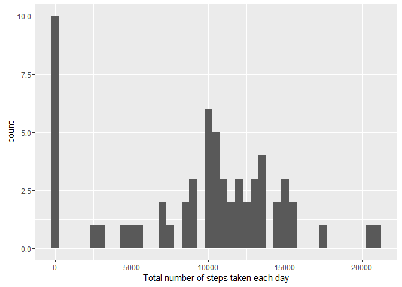
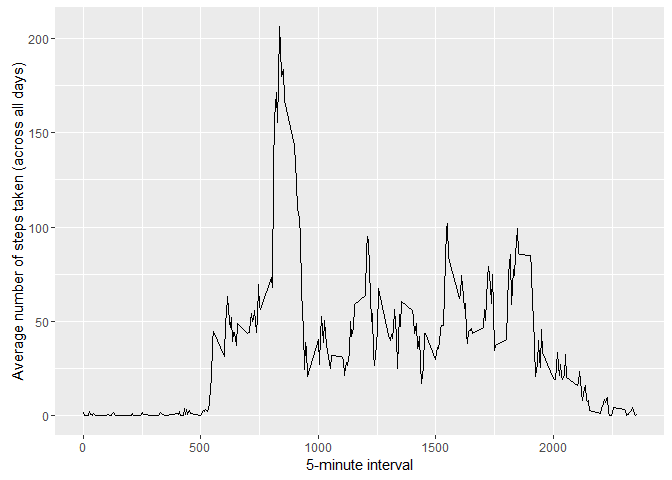
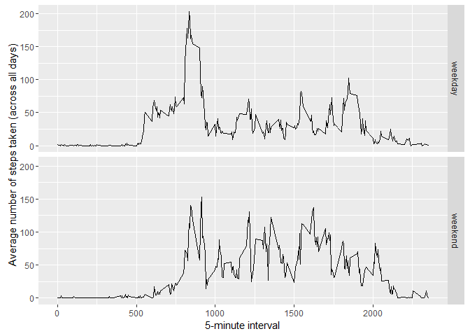

# Reproducible Research: Peer Assessment 1


## Loading and preprocessing the data
The following code extracts the data file activity and reads it in. The values in column "date" are converted to the type date, and the number of steps at each interval are converted to numeric values.

```r
activity<-unzip("activity.zip")
data<-read.csv("activity.csv", stringsAsFactors = FALSE)
data$date<-as.Date(data$date, "%Y-%m-%d")
data$steps<-as.numeric(data$steps)
```


## What is mean total number of steps taken per day?
The mean total number of steps was calculated by taking the sum of the steps taken each day.

```r
steps_per_day<-tapply(data$steps, data$date, sum, na.rm = TRUE)
steps_per_day<-as.data.frame.table(steps_per_day, stringsAsFactors = FALSE)
names(steps_per_day)[1:2]<-c("Date", "TotSteps")
steps_per_day$Date<-as.Date(steps_per_day$Date, "%Y-%m-%d")
```
This was stored as a separate data table and plotted as a histogram.

```r
library(ggplot2)
g<-ggplot(steps_per_day, aes(x=TotSteps))
p<-g+geom_histogram(binwidth = 500) +xlab("Total number of steps taken each day")
print(p)
```

<!-- -->

```r
mean_steps<-mean(steps_per_day$TotSteps)
median_steps<-median(steps_per_day$TotSteps)
```
The mean number of steps is 9354.23. The median number of steps is 1.04\times 10^{4}.

## What is the average daily activity pattern?

To explore the average daily activity pattern, a time series plot (i.e. type = "l") of the 5-minute interval (x-axis) is plotted against the average number of steps taken, averaged across all days (y-axis). 


```r
interval_steps<-tapply(data$steps, data$interval, mean, na.rm = TRUE)
interval_steps<-as.data.frame.table(interval_steps, stringsAsFactors = FALSE)
names(interval_steps)[1:2]<-c("Interval", "AvSteps")
interval_steps$Interval<-as.numeric(interval_steps$Interval)
g<-ggplot(interval_steps, aes(x=Interval, y=AvSteps))
p<-g+geom_line() + xlab("5-minute interval") + ylab("Average number of steps taken (across all days)")
print(p)
```

<!-- -->

```r
most_steps<-subset(interval_steps, interval_steps$AvSteps==max(interval_steps$AvSteps))
```
The 5-minute interval, on average across all the days in the dataset, that contains the maximum number of steps is 835.


## Imputing missing values
There are a number of days/intervals where there are missing values in the data (coded as NA). 

```r
Tot_NA<-sum(is.na(data$steps))
```
There are `rTot_NA` missing values in the dataset (i.e. the total number of rows with NAs). The presence of missing days may introduce bias into some calculations or summaries of the data.
In this report, the missing values in the dataset will be filled using the mean value for that day. First, let's generate a table of means for each day.


```r
day_means<-tapply(data$steps, data$date, mean, na.rm = TRUE)
day_means<-replace(day_means,is.nan(day_means),0) 
day_means<-as.data.frame.table(day_means, stringsAsFactors = FALSE)
names(day_means)[1:2]<-c("Date", "MeanSteps")
day_means$Date<-as.Date(day_means$Date, "%Y-%m-%d")
```

Now a new dataset can be created that is equal to the original dataset but with the missing data filled in.

```r
library(data.table)
day_means<-as.data.table(day_means, key= "Date")
data2<-data.table(data, key = "date")

#merge data.tables based on keys
data_fill<-data2[day_means]
#replace na values with mean values for that day
data_fill<-data_fill[is.na(steps),steps:=MeanSteps]
#just keep the original columns needed
data_fill<-data_fill[,list(steps, date, interval)]
```

Finally a histogram is plotted of the total number of steps taken each day.


```r
steps_per_day2<-tapply(data_fill$steps, data_fill$date, sum, na.rm = TRUE)
steps_per_day2<-as.data.frame.table(steps_per_day2, stringsAsFactors = FALSE)
names(steps_per_day2)[1:2]<-c("Date", "TotSteps")
steps_per_day2$Date<-as.Date(steps_per_day2$Date, "%Y-%m-%d")
library(ggplot2)
g<-ggplot(steps_per_day2, aes(x=TotSteps))
p<-g+geom_histogram(binwidth = 500) +xlab("Total number of steps taken each day")
print(p)
```

<!-- -->

```r
mean_stepsFill<-mean(steps_per_day2$TotSteps)
median_stepsFill<-median(steps_per_day2$TotSteps)
```

The mean and median number of steps per day in the filled data are 9354.23 and 1.04\times 10^{4}, respectively. 

There is therefore no difference between the estimates from the first part of the assignment and those calculated from the filled data set.  In this instance there is no impact from imputing missing data on the estimates of the total daily number of steps.  In this data set the NAs were always present when an entire days worth of data was missing.  Therefore the mean for that day was always zero.  Replacing NAs with the mean for that day, i.e. zero was essentially the same treatment as simply ignoring NA values (the treatment given in the first part of the assignment). If the values had been replaced with the mean for that 5-minute interval, calculated across all the days, a difference would have been seen.


## Are there differences in activity patterns between weekdays and weekends?
Using the dataset with the filled-in missing values a new factor variable was created in the dataset with two levels - "weekday" and "weekend", indicating whether a given date is a weekday or weekend day.


```r
#use weekdays() to determine days of the week for each date
data_fill$days<-weekdays(data_fill$date, abbreviate = TRUE)
#create a separate list of only weekdays
days2<-c("Mon","Tue", "Wed", "Thu", "Fri")
#create a column of levels for the factor true or false if days in data_fill are weekdays/weekend
data_fill$levels<-factor(data_fill$days %in% days2, levels = c("TRUE", "FALSE"), labels = c("weekday", "weekend"))
#only keep the columns needed
data_fill<-data_fill[,list(steps,date,interval,levels)]
```
A panel plot of compares the difference between the 5-minute intervals (x-axis) and the average number of steps taken, averaged across all weekdays or weekend days(y-axis).


```r
data_weekday<-data_fill[data_fill$levels=="weekday"]
interval_steps_weekday<-tapply(data_weekday$steps, data_weekday$interval, mean, na.rm = TRUE)
interval_steps_weekday<-as.data.frame.table(interval_steps_weekday, stringsAsFactors = FALSE)
names(interval_steps_weekday)[1:2]<-c("Interval", "AvStep")
interval_steps_weekday$Interval<-as.numeric(interval_steps_weekday$Interval)
interval_steps_weekday$day<-"weekday"

data_weekend<-data_fill[data_fill$levels=="weekend"]
interval_steps_weekend<-tapply(data_weekend$steps, data_weekend$interval, mean, na.rm = TRUE)
interval_steps_weekend<-as.data.frame.table(interval_steps_weekend, stringsAsFactors = FALSE)
names(interval_steps_weekend)[1:2]<-c("Interval", "AvStep")
interval_steps_weekend$Interval<-as.numeric(interval_steps_weekend$Interval)
interval_steps_weekend$day<-"weekend"

avsteps<-rbind(interval_steps_weekday, interval_steps_weekend)

avstep_plot<-ggplot(avsteps, aes(x=Interval, y=AvStep))
p<-avstep_plot+geom_line() + xlab("5-minute interval") + ylab("Average number of steps taken (across all days)")
g<-p+facet_grid(day ~ .)
print(g)
```

<!-- -->


```r
most_wkday<-subset(interval_steps_weekday,interval_steps_weekday$AvStep==max(interval_steps_weekday$AvStep))
mean_wkend<-mean(interval_steps_weekend$AvStep)
mean_wkday<-mean(interval_steps_weekday$AvStep)
```

On weekdays there is large peak of activity relatively early in the day at the 835 5-minute interval. After which the average number of steps taken drops significantly.  The mean of the average number of steps taken (across all days) is 30.63.  For weekends there are a number of peaks throughout the day, with overall a slightly higher mean of 37.69.

